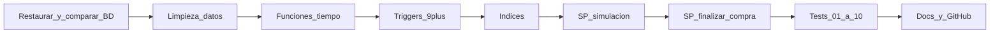

# Plan: Examen práctico BD para Negocios Digitales (100 pts)

## Qué enfocar ahora (antes que el paquete completo)

Tu **prioridad inmediata** —lo que el enunciado exige corregir primero en la línea temporal— es:

1. `**sesiones`**: **fecha de registro / inicio distinta** de **fecha de fin** (`fin_sesion` > `inicio_sesion`); simular sesiones de forma que no queden iguales ni incoherentes con la duración.
2. `**carritos`**: `**fecha_actualizacion**` debe **moverse en cada alta** en detalle (ej.: primer ítem 11:43, segundo a los 3 min → carrito actualizado a **11:46**).
3. `**carrito_detalle`**: marcas de tiempo **crecientes** por línea; tiempos entre productos vía `**fn_tiempo_realista`** (`RAND` + `TIMESTAMPADD`); productos **reales** del catálogo y **horarios de boutique** (ventana diurna coherente para inicio, registro, actualización y fin).

**Artefactos mínimos para este bloque** (cuando implementes): `fn_duracion_sesion`, `fn_tiempo_realista`, ajuste robusto de `**sp_simular_carrito`** (bucle ordenado INSERT detalle → UPDATE carrito), y consultas de verificación (p. ej. un carrito de ejemplo con 2 líneas y horarios como el 11:43 / 11:46).

**El entregable final del curso** sigue siendo el **paquete completo**: script `.sql` (tablas, triggers, funciones, procedimientos, índices), diccionario, 10 tests con capturas, diagramas, Power BI, GitHub y carpeta de IA —pero **la base lógica** de tiempo en las tres tablas anteriores es lo que debes tener bien **antes** de confiar en las pruebas masivas y en la bitácora.

---

## Contexto y prerequisitos

- **Entorno**: MySQL + Workbench; Power BI (u otra herramienta) para Test 10; Git/GitHub para entrega.
- **Datos base**: Necesitas el **dump del docente** y el **backup del equipo** para coexistir en el mismo servidor (dos esquemas o prefijos claros) y poder comparar.
- **Carpeta local del proyecto**: `[C:\Users\ASUS\Desktop\sql](C:\Users\ASUS\Desktop\sql)` está vacía; al implementar, crearás aquí (o clonarás) el repo con `/BD`, `/Tests`, `/Asistencia_IA`.

---

## Recursos necesarios

| Recurso                                              | Uso                                                                    |
| ---------------------------------------------------- | ---------------------------------------------------------------------- |
| **Base de datos del docente**                        | Análisis comparativo (Actividad 1) y referencia de esquema             |
| **Base de datos del equipo**                         | Versión previa del proyecto integrador; unificación con la del docente |
| **MySQL** + **Workbench**                            | Ejecución de scripts, modelado, diagramas, pruebas                     |
| **Git / GitHub**                                     | Control de versiones y entrega con estructura de carpetas              |
| **Power BI** (u otra herramienta libre para Test 10) | Visualización: pagos por origen                                        |

---

## Hoja de ruta (orden de trabajo)

1. **Sincronizar**: Unificar la BD del docente con la del equipo (una base de trabajo + respaldo de la otra si deben coexistir).
2. **Limpiar**: `DELETE` en `carritos`, `carrito_detalle`, `pedidos` y registros de **bitácora** asociados exclusivamente a esas tablas (orden por FKs).
3. **Programar lógica**: Funciones de tiempo (`fn_duracion_sesion`, `fn_tiempo_realista`), **mínimo 9 triggers** (distribución abajo), `sp_simular_carrito`, `sp_finalizar_compra`.
4. **Optimizar**: Índices en columnas que más usan los Tests (p. ej. `categoria_id`, `fecha_pedido`, `usuario_id` / `cliente_id`).
5. **Simular**: Ejecutar pruebas masivas de **1 a 10 000** compras según Tests 01–06.
6. **Documentar**: Subir a GitHub con README, `/BD`, `/Tests`, `/Asistencia_IA` (ver Entregables).

---

## Entregables (qué debes devolver)

- **Script(s) `.sql`**: Un archivo único **o** dividido por secciones comentadas (DDL tablas, datos semilla si aplica, funciones, procedimientos, triggers, índices, pruebas de inserción).
- **Documentación PDF y/o Markdown**: **Diccionario de datos** + **reporte de los 10 Tests** (descripción, resultado, **capturas de pantalla**).
- **Diagramas**: Archivos imagen o PDF del **DER** y del **diagrama relacional** (también en `/BD`).
- **Carpeta de IA** (`/Asistencia_IA`): PDF con el **log de prompts** utilizados durante el desarrollo.

---

## Tablas críticas involucradas

- **usuarios** / **clientes**: nombres, vínculo con sesiones y compras.
- **productos** y **categorias**: filtros por “Perfumería”, “Ropa para mujer”, “Ropa para hombre”, etc.
- **carritos** y **carrito_detalle**: intención de compra y línea temporal de selección.
- **pedidos**: venta formal.
- **metodos_pago** y **transacciones_financieras**: cobro y conciliación.
- **bitacora**: movimientos registrados por triggers (auditoría).
- **sesiones** (si existe en el esquema): coherencia temporal con carrito y detalle (ver sección siguiente).

---

## Reglas de negocio: tiempo (tablas `sesiones`, `carritos`, `carrito_detalle`)

Estas reglas deben cumplirse en la **simulación** y validarse en Tests 08–09.

**Sesión**

- **Inicio / registro de sesión** y **fin de sesión** deben ser **distintos**, con **fin > inicio**.
- La **duración** debe ser coherente con la suma de acciones (navegación + tiempo entre productos + cierre); debe cuadrar con `fn_duracion_sesion`.
- **Simulación “boutique”**: generar marcas de tiempo dentro de **horarios de tienda** plausibles (por ejemplo ventana diurna tipo 10:00–21:00, sin mezclar medianoche salvo que el modelo lo exija). Documentar el rango elegido en el diccionario de datos.

**Carrito**

- **Fecha de creación / registro del carrito**: alineada con el **inicio de la sesión** o pocos instantes después (login → empieza carrito), nunca posterior al **último** movimiento del detalle.
- **Fecha de actualización**: debe **cambiar en cada alta de línea en `carrito_detalle`** (comportamiento tipo “última actividad”). Ejemplo obligatorio del enunciado: primer producto a las **11:43**, segundo tres minutos después → la actualización del carrito debe reflejar **11:46** (o el timestamp del último detalle insertado).

**Detalle del carrito**

- Cada fila lleva un **momento de selección** (columna dedicada `fecha_agregado` / `fecha_linea` o la que defina el esquema) **estrictamente creciente** dentro del mismo carrito: t_1 < t_2 < \cdots < t_n.
- Esos instantes deben caer **entre** `inicio_sesion` y `fin_sesion` (o hasta el cierre de compra, según definición documentada de `fin_sesion`).

**Implementación (elegir una estrategia y documentarla)**

- **Opción A**: todo lo anterior se garantiza dentro de `sp_simular_carrito` (INSERT detalle → UPDATE `carritos.fecha_actualizacion` al timestamp del ítem).
- **Opción B**: trigger `AFTER INSERT` en `carrito_detalle` que actualice `carritos.fecha_actualizacion` (útil si los inserts no siempre pasan por un solo SP; cuenta para integridad si el docente lo valora).

---

## Actividad 1 – Restauración y análisis

- Restaurar la BD grupal desde el servidor del docente.
- Comparar **esquema y datos** con la versión del equipo: tablas faltantes, tipos de columnas, nombres de restricciones, relaciones `carritos` ↔ `sesiones` ↔ `carrito_detalle` ↔ `pedidos` ↔ `transacciones_financieras` ↔ `bitacora`.
- Documentar diferencias en el diccionario de datos o en un anexo breve (sirve para la sección de análisis del README).

## Actividad 2 – Integración de versiones

- Elegir **una** BD base para las adecuaciones (normalmente la unificada tras fusionar lo mejor de ambas).
- Respaldar antes de cambios masivos; importar la otra como referencia (p. ej. `ecommerce_docente` vs `ecommerce_equipo`) solo para análisis si el enunciado pide coexistencia.

## Actividad 3 – Triggers (mínimo 9)

Distribución acordada con el enunciado / guía del profesor (ajustar nombres al esquema real):

| Tabla                       | Cantidad | Disparadores                                                                                                                                                                                    |
| --------------------------- | -------- | ----------------------------------------------------------------------------------------------------------------------------------------------------------------------------------------------- |
| `pedidos`                   | 3        | **AFTER INSERT**: apoyar el flujo de carrito → pedido (sincronizar o completar datos según modelo). **BEFORE UPDATE**: validar cambio de estatus. **AFTER UPDATE**: registro en **bitácora**.   |
| `metodos_pago`              | 3        | **BEFORE INSERT**: validar formato/datos. **AFTER UPDATE** y **AFTER DELETE**: auditoría en **bitácora**.                                                                                       |
| `transacciones_financieras` | 3        | **BEFORE INSERT**: verificar saldo o vigencia (según reglas del modelo). **AFTER INSERT**: actualizar estatus del pedido. **AFTER INSERT** (u otro evento coherente): **bitácora de ingresos**. |

Nota: MySQL no permite dos triggers `AFTER INSERT` distintos en la misma tabla con el mismo timing; si el enunciado exige “dos AFTER INSERT” en `transacciones_financieras`, **unificar la lógica en un solo trigger** `AFTER INSERT` que haga pedido + bitácora en secuencia, o repartir uno como `BEFORE INSERT` / `AFTER INSERT` según permita el motor y el docente.

- Unificar criterios de **bitácora** (quién escribe, qué tabla_origen, qué evento).
- Probar que no haya recursión infinita entre triggers.

## Actividad 4 – Limpieza de datos

- `DELETE` ordenado por FKs en: `carrito_detalle` → `carritos` → `pedidos` (y lo que dependa).
- Limpiar en `bitacora` solo lo **asociado** a esas entidades (según diseño: por `tabla`/`entidad` o `referencia_id`); no borrar bitácora de otras áreas si el modelo lo prohíbe.

## Actividad 5 – Función `fn_duracion_sesion`

- Entrada: inicio y fin de sesión (o `sesion_id`).
- Salida: cadena en formato **HH:MM:SS** (usar `TIMEDIFF` + `TIME_FORMAT` o `SEC_TO_TIME` según versión de MySQL).

## Actividad 6 – Función de tiempo realista (`fn_tiempo_realista` o nombre acordado)

- Implementación típica: `RAND()` acotado y `TIMESTAMPADD(MINUTE|SECOND, …, fecha_base)` (o equivalente) para sumar **intervalos aleatorios** entre la elección de un producto y el siguiente.
- A partir de un `DATETIME` base, sumar **minutos/segundos aleatorios acotados** (p. ej. 1–8 min entre productos, o 3 minutos fijos para reproducir el ejemplo 11:43 → 11:46) coherentes con una boutique (lectura de fichas, talla, color).
- Usarla en la simulación para que **cada línea de `carrito_detalle`** tenga marca de tiempo **posterior** a la anterior.
- Tras cada inserción de detalle, **sincronizar** `carritos.fecha_actualizacion` con el timestamp de **ese** detalle (último gana), de modo que el carrito siempre muestre la hora del **último** producto añadido.

## Actividad 7 – Índices

- Justificar en documentación: columnas usadas en filtros de tests y vistas, p. ej. `categoria_id`, fechas de pedido/carrito, `usuario_id`/`cliente_id`, FKs frecuentes.
- Crear índices **después** de definir consultas críticas; evitar duplicar índices ya cubiertos por PK/UNIQUE.

## Actividad 8 – Procedimiento de simulación (`sp_simular_carrito`)

- Flujo temporal obligatorio:
  1. Crear **sesión** con `inicio_sesion` y `fin_sesion` **obligatoriamente distintos** (`fin_sesion` > `inicio_sesion`). Evitar el error típico de dejar `fin_sesion = inicio_sesion` o nulo.
  2. Insertar **carrito** con `fecha_creacion` / registro **coherente** con el inicio de sesión (misma franja horaria boutique).
  3. Bucle por cada producto: calcular `t_n = fn_tiempo_realista(t_{n-1})`; `INSERT` en `carrito_detalle` con `t_n`; luego `UPDATE carritos` con `fecha_actualizacion = t_n` (o igual al timestamp del detalle insertado). Así se cumple el ejemplo 11:43 / 11:46.
  4. Asignar `fin_sesion` a un instante **posterior** al último `t_n` (p. ej. 1–5 minutos de “revisión checkout” o cierre de sesión), sin superar el horario lógico del día.
- **Datos realistas**: elegir productos existentes del catálogo (categorías Perfumería, Ropa, etc.) y clientes reales de la tabla de usuarios; no repetir siempre los mismos IDs en bucles masivos salvo que el test lo pida.
- Parámetros típicos: número de compras, categoría opcional, rango de fechas (año 2026 para Test 03).

## Actividad 9 – Procedimiento de transacción financiera (`sp_finalizar_compra`)

Es el procedimiento **central** del examen: transformación **carrito → compra** con integridad. **Debe usar**:

- Transacciones SQL explícitas: **START TRANSACTION** / **BEGIN**, **COMMIT**, **ROLLBACK**.
- **Control de errores** (handlers, validaciones previas) y mensajes claros.
- **Integridad de datos**: no dejar pedidos huérfanos, montos coherentes, estatus alineados con triggers de `pedidos` / `transacciones_financieras`.

Pasos lógicos habituales: validar carrito abierto y líneas; crear **pedido**; insertar líneas de pedido si el modelo lo requiere; insertar **transacción_financiera**; actualizar estatus; cerrar o vaciar carrito según reglas; ante error, **ROLLBACK**.

---

## Pruebas (Tests 01–10)

| Test | Objetivo                                                                                                                                                                                                                         |
| ---- | -------------------------------------------------------------------------------------------------------------------------------------------------------------------------------------------------------------------------------- |
| 01   | 1 compra completa: carrito → detalle → pedido → transacción                                                                                                                                                                      |
| 02   | 10 compras, categoría **Perfumería**                                                                                                                                                                                             |
| 03   | 100 compras en **2026**                                                                                                                                                                                                          |
| 04   | 1000 compras, **Ropa para mujer**                                                                                                                                                                                                |
| 05   | 500 compras, **Ropa para hombre**                                                                                                                                                                                                |
| 06   | 10 000 compras generales                                                                                                                                                                                                         |
| 07   | **Vista** integral: comprador, fechas de sesión, duración, carrito (creación, total productos, monto estimado), pedido (fecha, productos, importe, **estatus**), pago (**fecha, importe, origen**), **tiempo total del proceso** |
| 08   | Por `carrito_id`: orden de selección de productos por tiempo                                                                                                                                                                     |
| 09   | Métricas: duración sesión, tiempo selección productos, tiempo aprobación pago                                                                                                                                                    |
| 10   | Dashboard: pagos por **origen** (export/captura desde Power BI u otra herramienta)                                                                                                                                               |

- En `/Tests`: tabla por test con número, nombre, descripción, resultado, evidencias (capturas).

---

## Actividad 10 – Repositorio GitHub

Estructura mínima (coincide con **Entregables**):

- **README.md**: portada con logos, nombre de actividad, integrantes, descripción, tabla de colaboradores con enlaces a perfiles GitHub.
- `**/BD`**: respaldo o script(s) `.sql` (tablas, datos, funciones, procedimientos, triggers, índices), **DER**, **diagrama relacional**, **diccionario de datos**.
- `**/Tests`**: documentación de los 10 Tests con número, nombre, descripción, resultado, **capturas**.
- `**/Asistencia_IA`**: PDF con log de prompts.

**Consideración de evaluación**: commits y PRs distribuidos entre integrantes; reflejar trabajo colaborativo en el historial.

---

## Orden de implementación recomendado

---

## Riesgos y decisiones pendientes (al tener el dump real)

- Nombres exactos de tablas/columnas (`sesiones` vs `sesion`, `fecha_actualizacion`, columna de timestamp en `carrito_detalle`).
- Reglas de estatus de pedido y catálogo de **orígenes de pago** para Test 10.
- Definición explícita de **fin de sesión**: ¿al abandonar la navegación, al cerrar carrito o al confirmar pago? Debe quedar **documentada** y ser **consistente** con Tests 08–09 y con la desigualdad **inicio ≠ fin**.
- Si el guía pide dos `AFTER INSERT` en la misma tabla, validar con Workbench/MySQL la sintaxis permitida y consolidar en un trigger o repartir eventos sin duplicar timing ilegal.

Cuando confirmes este plan o indiques el archivo `.sql` del docente/equipo, el siguiente paso será implementar en el repo y scripts según el esquema real.